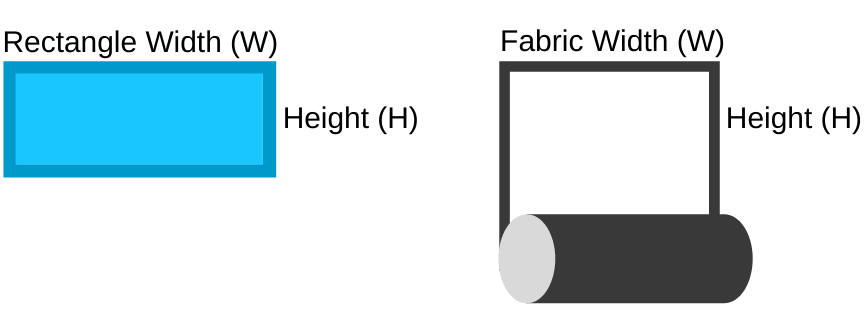

<!DOCTYPE html>

<html>

<head>
    <meta charset="UTF-8">
    <meta name="author" content="cottonrays.com">
    <meta name="keywords" content="sewing,fabric,cut,optimize,cuttlefish,cottonrays"> 
    <meta name="viewport" content="width=device-width, initial-scale=1.0">
    <link rel="icon" href="./imgs/icon.png">
    <title>Cuttlefish: Fabric Cut Optimizer by Cottonrays</title>
    <link rel="stylesheet" type="text/css" href="./css/stylesheet.css">
</head>
<body>
    
    

    

        <h1>Cuttlefish: Fabric Cut Optimizer</h1>
        
Cutting rectangles (or squares) of varying sizes from a piece of fabric?

        
This lightweight app provides a <i>heuristic</i> to optimize the use of your fabric, minimizing scraps and wastage.

         <ul>
          <li>Input the width of your fabric roll</li>
          <li>Input the width and height of your rectangles required</li>
          <li>Use either inches or cm, just be consistent</li>
          <li>You may use decimal places in your inputs</li>
        </ul> 

        
Note that rectangles will <b>not</b> be rotated to preserve how you'd like the pieces to be patterned along the fabric grain.
 

        

            
        

        

            <label for="fabric_width">Fabric Width:</label>
            <input type="number" id="fabric_width" min="1" value="54" placeholder="Fabric Width">
        

         
        

            
Rectangles Required:

            

                <input type="number" id="box_width0" min="1" value="8" placeholder="Width"><input type="number" id="box_height0" min="1" value="4" placeholder="Height">
            
    
        

        

        

            <button class="add-button" onclick="addField()">Add More</button>
        

        

            

            

        

        

            

                <button class="gen-button" id="gen-button">Generate</button>
            

        

            
        

            

        

            
        <canvas id="canvas"></canvas>

        

            

                For more information on how this app works and its known limitations, visit <a href="https://github.com/cottonrays/cuttlefish#technical-notes">https://github.com/cottonrays/cuttlefish#technical-notes</a>.
            

            

                Got feedback? Let me know in this 3-question survey: <a href="https://forms.gle/MSXG9oHt3z6gwaMh9">https://forms.gle/MSXG9oHt3z6gwaMh9</a>
            

        

    

    

    

        
Built on top of Mapbox: Copyright &copy; 2018, Mapbox, ISC License.

        
Copyright &copy; 2020 to present, <a href="https://github.com/cottonrays/cuttlefish">Cottonrays.com</a>

    

</body>
</html>
